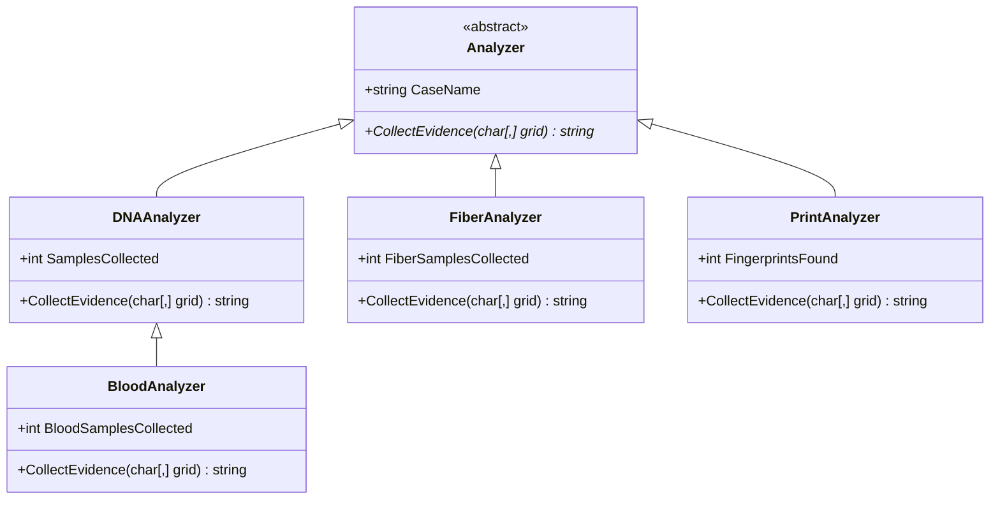

# Forensic Evidence Analyzer


A Windows Forms application that simulates a forensic investigation. Crime scenes are represented as plain-text character grids; the app parses a grid, runs it through a chosen evidence analyzer, and reports what was found. The project's real purpose is to demonstrate object-oriented design — abstraction, inheritance, and polymorphism — through a small but genuine multi-level class hierarchy.

## Overview

Load any text file containing a crime-scene grid, pick an evidence type from the interface, and the analyzer scans the grid and returns a count. Under the hood, each evidence type is its own `Analyzer` subclass that implements evidence collection differently — some inherit from one another, some don't — which is the whole point of the exercise.

## Features

- Load a crime-scene grid from any `.txt` file via a standard file picker
- Four evidence analyzers, selectable at runtime: **Fingerprint**, **DNA**, **Blood**, **Fiber**
- Each analysis run is tagged with a case name (pulled from the loaded filename)
- Instant, human-readable result summary in the UI

## How a Crime Scene File Works

A crime scene is a plain-text file where each line is a row of the grid and each character is a cell. Specific characters are recognized as evidence by specific analyzers:

| Character | Evidence | Recognized by |
|:---:|---|---|
| `@` | Fingerprint | `PrintAnalyzer` |
| `D` | DNA sample | `DNAAnalyzer` |
| `H` | DNA sample (hair) | `DNAAnalyzer` |
| `F` | DNA sample **and** fiber | `DNAAnalyzer`, `FiberAnalyzer` |
| `B` | Blood | `BloodAnalyzer` |
| anything else | — | ignored by every analyzer |

`F` is intentionally shared: `DNAAnalyzer` treats a fiber marker as a DNA-bearing sample, while `FiberAnalyzer` treats the same character as fiber evidence. Which count you get back depends entirely on which analyzer you run — the grid itself doesn't change.

> **Note:** the loader determines the grid's column count from the *first* line of the file and indexes every subsequent row against it, so input files must be rectangular (every row the same length) or the file will fail to load.

## Architecture

The project's core is a small, deliberate class hierarchy: one abstract base, one three-level inheritance chain, and two independent siblings.



- **`Analyzer`** — abstract base class. Declares `CaseName` and the abstract method every analyzer must implement: `CollectEvidence(char[,] grid)`.
- **`DNAAnalyzer`** — extends `Analyzer` directly. Scans for `D`, `H`, and `F` and reports a DNA sample count.
- **`BloodAnalyzer`** — extends `DNAAnalyzer`, making it the third level in that chain. It doesn't call `base.CollectEvidence()`; it fully overrides the method to scan for `B` only. A case run through `BloodAnalyzer` reports blood samples exclusively, even though the class technically inherits DNA-scanning behavior.
- **`PrintAnalyzer`** and **`FiberAnalyzer`** — independent siblings that extend `Analyzer` directly (not through `DNAAnalyzer`), each implementing its own single-purpose scan (`@` and `F` respectively).

All five classes are polymorphic through the same interface: the form holds a single `Analyzer` reference and calls `CollectEvidence(grid)` on it without needing to know which concrete analyzer it's running.

## Using the App

1. **Select File** — opens a file picker; the chosen path is loaded into an in-memory `char[,]` grid, with a confirmation dialog on success.
2. **Choose an analyzer** — pick one of the four radio buttons (Fingerprint / DNA / Blood / Fiber).
3. **Analyze** — instantiates the corresponding analyzer, tags it with the case name (the loaded file's name), runs `CollectEvidence` against the grid, and displays the result.

Only one evidence type is analyzed per click. To check a second evidence type on the same grid, select a different radio button and click Analyze again — the grid stays loaded between runs.

## Example

Given a crime-scene file like:

```
@..D.B
.F@..H
..B..F
```

Running each analyzer against this grid returns:

| Analyzer | Result |
|---|---|
| `PrintAnalyzer` | Fingerprints found: 2 |
| `DNAAnalyzer` | Samples collected: 4 |
| `FiberAnalyzer` | Fiber samples collected: 2 |
| `BloodAnalyzer` | Blood samples collected: 2 |

## Getting Started

**Requirements**
- Windows
- Visual Studio 2019 or later (with the .NET desktop development workload), or the .NET SDK for CLI builds
- .NET Framework 4.7.2

**Build and run**

```bash
git clone https://github.com/KhiProspere41/Forensic-Evidence-Analyzer-.git
cd Forensic-Evidence-Analyzer-
```

Open `ForensicEvidenceAnalyzer.csproj` in Visual Studio and press **F5** to build and run, or build from the CLI:

```bash
dotnet build
```

## Project Structure

```
Forensic-Evidence-Analyzer-/
├── Analyzer.cs              # Abstract base class
├── DNAAnalyzer.cs           # DNA evidence analyzer
├── BloodAnalyzer.cs         # Blood evidence analyzer (extends DNAAnalyzer)
├── FiberAnalyzer.cs         # Fiber evidence analyzer
├── PrintAnalyzer.cs         # Fingerprint evidence analyzer
├── Form1.cs                 # Main UI: file loading, analyzer selection, results
├── Form1.Designer.cs
├── Form1.resx
├── Program.cs                # Application entry point
├── ForensicEvidenceAnalyzer.csproj
└── .github/workflows/dotnet.yml   # CI build
```

## Notes & Known Behavior

- Input files must be rectangular — every row the same length as the first.
- `F` counts toward both DNA and Fiber results by design, not by accident; running both analyzers on the same file will show the overlap.
- `BloodAnalyzer` inherits from `DNAAnalyzer` but overrides evidence collection completely, so it reports blood counts only — it's an inheritance relationship used for code organization, not behavior reuse.
